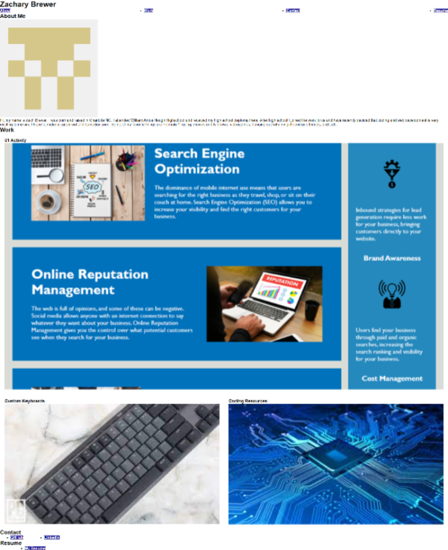

# Portfolio Challenge

## Description

In this challenge I stared by creating a resopitory from scratch with a README. I then added an html.index file as well as an assets folder with sub folders for css and images. I used what we have learned about flexbox in css to style my webpage and resize my images to fit the screen in a more apealing way. I added links to those images so that the user can look at my previous work. I also added styling to the nav, contact and resume sections.

## Screenshot

## Link
[Link to deployed site](https://zacharydotpy.github.io/portfolio-challenge/)